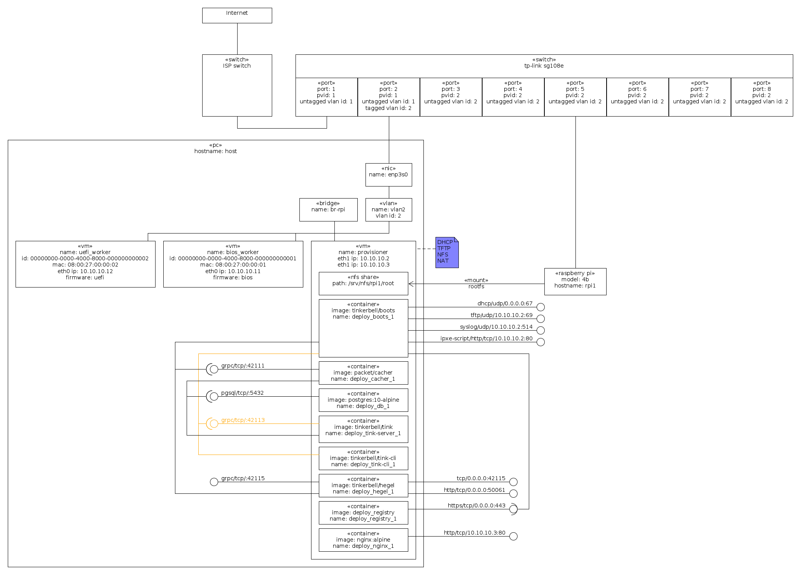
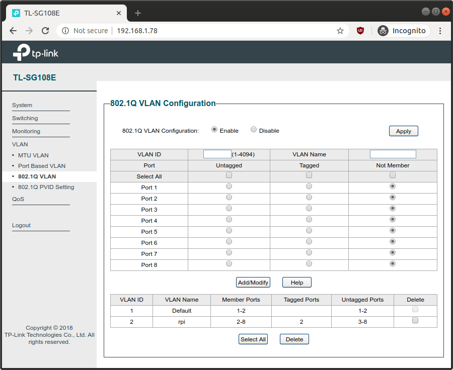
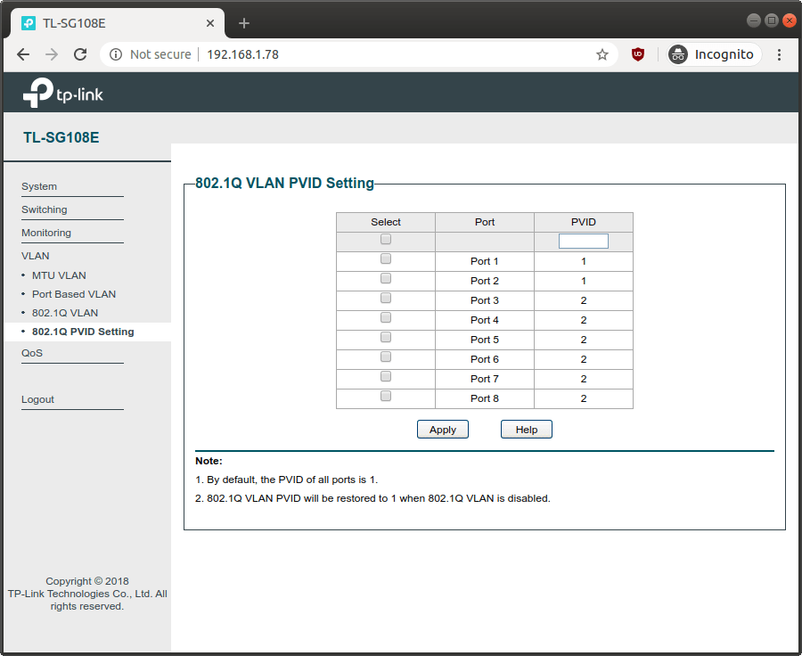

**NB** This is still a Work In Progress. Its NOT YET FULLY WORKING.

This is a [Vagrant](https://www.vagrantup.com/) Environment for playing with [Tinkerbell](https://tinkerbell.org/) for provisioning Raspberry Pis.

# Usage

This `provisioner` environment is essentially running all the Tinkerbell [components](https://tinkerbell.org/components/) inside a single virtual machine.

In order for it to work you need to connect the `provisioner` virtual network to a physical network that reaches the Raspberry Pis.

I'm using Ubuntu 18.04 as the host, qemu/kvm/libvirt has the hypervisor, and a [tp-link tl-sg108e](https://www.tp-link.com/en/business-networking/easy-smart-switch/tl-sg108e/) switch.

**NB** You can also use this vagrant environment without the switch (see the [Vagrantfile](Vagrantfile)).

The network is connected as:



The tp-link tl-sg108e switch is configured as:




**NB** this line of switches is somewhat insecure as, at least, its configuration protocol (UDP port 29808 and TCP port 80) uses clear text messages. For more information see [How I can gain control of your TP-LINK home switch](https://www.pentestpartners.com/security-blog/how-i-can-gain-control-of-your-tp-link-home-switch/) and [Information disclosure vulnerability in TP-Link Easy Smart switches](https://www.chrisdcmoore.co.uk/post/tplink-easy-smart-switch-vulnerabilities/).

The host network is configured by netplan with `/etc/netplan/config.yaml` as:

```yaml
network:
  version: 2
  renderer: networkd
  ethernets:
    enp3s0:
      dhcp4: yes
      nameservers:
        # NB on ubuntu this normally uses the system-resolved dns resolver and
        #    you can list the current upstream dns server addresses with:
        #       systemd-resolve --status
        addresses:
          # cloudflare+apnic public dns resolvers.
          # see https://en.wikipedia.org/wiki/1.1.1.1
          - "1.1.1.1"
          - "1.0.0.1"
          # google public dns resolvers.
          # see https://en.wikipedia.org/wiki/8.8.8.8
          #- "8.8.8.8"
          #- "8.8.4.4"
  bridges:
    # NB this is equivalent of executing:
    #       ip link add name br-rpi type bridge
    #       ip addr flush dev br-rpi
    #       ip addr add dev br-rpi 10.10.10.1/24
    #       ip link set dev br-rpi up
    #       ip addr ls dev br-rpi
    #       ip -d link show dev br-rpi
    #       ip route
    # NB later, you can remove with:
    #       ip link set dev br-rpi down
    #       ip link delete dev br-rpi
    br-rpi:
      addresses:
        - "10.10.10.1/24"
      interfaces:
        - vlan2
  vlans:
    # NB this is equivalent of executing:
    #       ip link add link enp3s0 vlan2 type vlan proto 802.1q id 2
    #       ip link set dev vlan2 up
    #       ip -d link show dev vlan2
    # NB later, you can remove with:
    #       ip link set dev vlan2 down
    #       ip link delete dev vlan2
    vlan2:
      id: 2
      link: enp3s0
```

**NB** For more information about VLANs see the [IEEE 802.1Q VLAN Tutorial](http://www.microhowto.info/tutorials/802.1q.html).

Build and install the [Ubuntu Linux base box](https://github.com/rgl/ubuntu-vagrant).

After the above is in place, run `vagrant up provisioner` to launch the provisioner.

Then launch the `bios_worker` worker with `vagrant up bios_worker`.

You can watch the progress with:

```bash
vagrant ssh provisioner
sudo su -l
docker exec -i deploy_tink-cli_1 tink workflow list
# NB get the workflow_id from the output of the previous workflow list command.
workflow_id=''
watch "docker exec -i deploy_tink-cli_1 tink workflow events $workflow_id"
```

You should eventually see something alike:

```
+--------------------------------------+-------------+-------------+----------------+---------------------------------+--------------------+
| WORKER ID                            | TASK NAME   | ACTION NAME | EXECUTION TIME | MESSAGE                         |      ACTION STATUS |
+--------------------------------------+-------------+-------------+----------------+---------------------------------+--------------------+
| 00000000-0000-4000-8000-000000000001 | hello-world | hello-world |              0 | Started execution               | ACTION_IN_PROGRESS |
| 00000000-0000-4000-8000-000000000001 | hello-world | hello-world |              0 | Finished Execution Successfully |     ACTION_SUCCESS |
+--------------------------------------+-------------+-------------+----------------+---------------------------------+--------------------+
```

Then repeat the same procedure to launch the `uefi_worker` worker with `vagrant up uefi_worker`.

# Raspberry Pi

Tinkerbell boots and the rpi PXE client are not compatible with each-other and
as such we will not use the rpi PXE client at all, instead we will use
iPXE/UEFI.

Create a [iPXE/UEFI](https://github.com/rgl/raspberrypi-uefi-edk2-vagrant)
sd-card with [balenaEtcher](https://www.balena.io/etcher/), put it in your pi
and power it on.

Press `ESC` to enter the UEFI setup, then:

1. Select `Device Manager`.
2. Select `Raspberry Pi Configuration`.
3. Select `Advanced Configuration`.
4. Select `System Table Selection`.
5. Select `Devicetree`.
6. Press `F10`.
7. Press `ESC` until you reach the main menu.
8. Select `Continue` to boot to the iPXE prompt.

At the iPXE boot prompt type the following command to boot tinkerbell osie:

```
chain --autofree http://${next-server}/auto.ipxe
```

The `auto.ipxe` script is handled by tinkerbell boots in:

* [job/http.go#Job.ServeFile](https://github.com/tinkerbell/boots/blob/10b79956134ae3badae65a668614b3e6b332ca3b/job/http.go#L15-L25)
* [job/ipxe.go#Job.serveBootScript](https://github.com/tinkerbell/boots/blob/a776430e1230851a873d9c5a945a8b5c8506f09f/job/ipxe.go#L47-L68)
* [installers/osie/main.go#install](https://github.com/tinkerbell/boots/blob/139cc4cdb1f9537acd3eaeac536e0d86f6df3624/installers/osie/main.go#L23-L36)

# Troubleshooting

## Network Packet Capture

You can see all the network traffic from within the provisioner by running:

```bash
vagrant ssh-config provisioner >tmp/provisioner-ssh-config.conf
wireshark -k -i <(ssh -F tmp/provisioner-ssh-config.conf provisioner 'sudo tcpdump -s 0 -U -n -i eth1 -w - not tcp port 22')
```

You can also do it from the host by capturing traffic from the `br-rpi` or `vlan2` interface.

## Logs

The logs are sent to Elasticsearch and you can inspect them with Kibana which
is available at the port 5601 of the host IP address.

To get the `boots` component logs, execute the following request in
the Kibana Dev Tools Console:

```json
GET _cat/indices

GET boots/_search
{
  "query": {
    "match_all": {}
  },
  "_source": [
    "@timestamp",
    "log"
  ],
  "sort": [
    {
      "@timestamp": "desc"
    }
  ]
}

DELETE boots
```

## Database

Tinkerbell uses the [tinkerbell](https://github.com/tinkerbell/tink/blob/master/deploy/db/tinkerbell-init.sql)
PostgreSQL database, you can access its console with, e.g.:

```bash
vagrant ssh provisioner
sudo su -l
docker exec -i deploy_db_1 psql -U tinkerbell -c 'select * from template'
docker exec -i deploy_db_1 psql -U tinkerbell -c 'select * from workflow'
docker exec -i deploy_db_1 psql -U tinkerbell -c 'select * from workflow_event order by created_at desc'
```

# Reference

* [IEEE 802.1Q VLAN Tutorial](http://www.microhowto.info/tutorials/802.1q.html)
* [ContainerSolutions/tinkerbell-rpi4-workflow](https://github.com/ContainerSolutions/tinkerbell-rpi4-workflow/tree/rpi4-tinkerbell-uefi)
