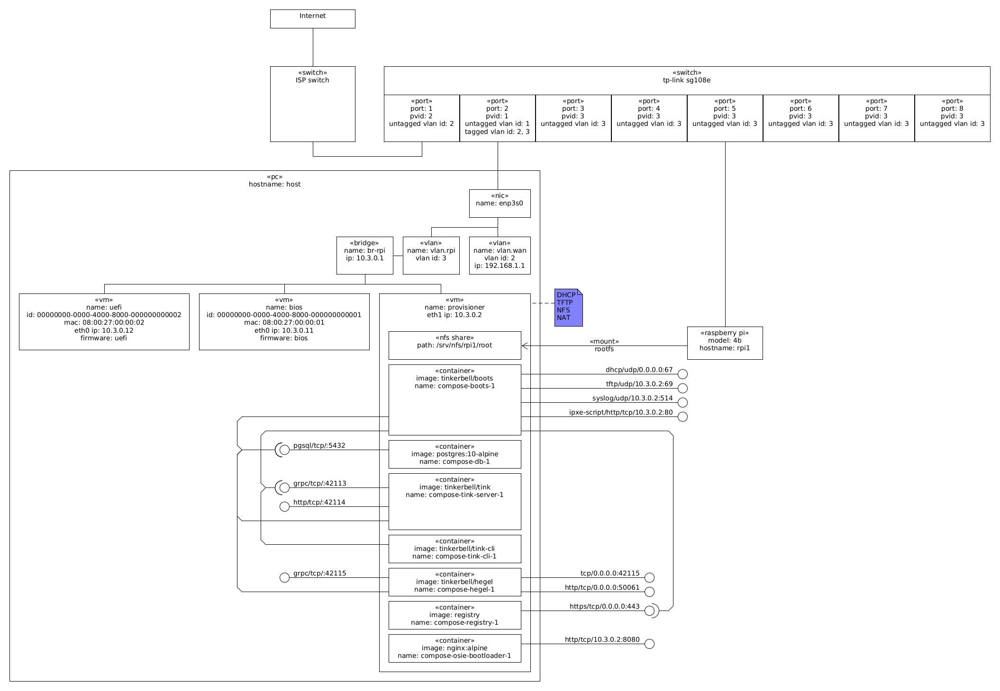

This is a [Vagrant](https://www.vagrantup.com/) Environment for playing with [Tinkerbell](https://tinkerbell.org/) for provisioning AMD64 and ARM64 (e.g. Raspberry Pi) machines.

# Usage

This `provisioner` environment is essentially running all the Tinkerbell [components](https://tinkerbell.org/components/) inside a single virtual machine.

In order for it to work you need to connect the `provisioner` virtual network to a physical network that reaches the physical machines.

I'm using Ubuntu 20.04 as the host, qemu/kvm/libvirt has the hypervisor, and a [tp-link tl-sg108e](https://www.tp-link.com/en/business-networking/easy-smart-switch/tl-sg108e/) switch.

**NB** You can also use this vagrant environment without the switch (see the [Vagrantfile](Vagrantfile)).

The network is connected as:



The tp-link tl-sg108e switch is configured with [rgl/ansible-collection-tp-link-easy-smart-switch](https://github.com/rgl/ansible-collection-tp-link-easy-smart-switch) as:


**NB** this line of switches is somewhat insecure as, at least, its configuration protocol (UDP port 29808 and TCP port 80) uses clear text messages. For more information see [How I can gain control of your TP-LINK home switch](https://www.pentestpartners.com/security-blog/how-i-can-gain-control-of-your-tp-link-home-switch/) and [Information disclosure vulnerability in TP-Link Easy Smart switches](https://www.chrisdcmoore.co.uk/post/tplink-easy-smart-switch-vulnerabilities/).

The host network is configured by netplan with `/etc/netplan/config.yaml` as:

```yaml
network:
  version: 2
  renderer: networkd
  ethernets:
    enp3s0:
      link-local: []
      addresses:
        - 10.1.0.1/24
        - 192.168.0.254/24
  bridges:
    # NB this is equivalent of executing:
    #       ip link add name br-rpi type bridge
    #       ip addr flush dev br-rpi
    #       ip addr add dev br-rpi 10.3.0.1/24
    #       ip link set dev br-rpi up
    #       ip addr ls dev br-rpi
    #       ip -d link show dev br-rpi
    #       ip route
    # NB later, you can remove with:
    #       ip link set dev br-rpi down
    #       ip link delete dev br-rpi
    br-rpi:
      link-local: []
      addresses:
        - 10.3.0.1/24
      interfaces:
        - vlan.rpi
  vlans:
    vlan.wan:
      id: 2
      link: enp3s0
      link-local: []
      addresses:
        - 192.168.1.1/24
      gateway4: 192.168.1.254
      nameservers:
        addresses:
          # cloudflare+apnic public dns resolvers.
          # see https://en.wikipedia.org/wiki/1.1.1.1
          - "1.1.1.1"
          - "1.0.0.1"
          # google public dns resolvers.
          # see https://en.wikipedia.org/wiki/8.8.8.8
          #- "8.8.8.8"
          #- "8.8.4.4"
    # NB this is equivalent of executing:
    #       ip link add link enp3s0 vlan.rpi type vlan proto 802.1q id 2
    #       ip link set dev vlan.rpi up
    #       ip -d link show dev vlan.rpi
    # NB later, you can remove with:
    #       ip link set dev vlan.rpi down
    #       ip link delete dev vlan.rpi
    vlan.rpi:
      id: 3
      link: enp3s0
      link-local: []
```

**NB** For more information about VLANs see the [IEEE 802.1Q VLAN Tutorial](http://www.microhowto.info/tutorials/802.1q.html).

Build and install the [Ubuntu Linux vagrant box](https://github.com/rgl/ubuntu-vagrant).

Build [Debian OSIE](https://github.com/rgl/tinkerbell-debian-osie) in `../tinkerbell-debian-osie`.

Optionally, build and install the following vagrant boxes (which must be using
the UEFI variant):

* [Debian](https://github.com/rgl/debian-vagrant)
* [Proxmox VE](https://github.com/rgl/proxmox-ve)
* [Ubuntu](https://github.com/rgl/ubuntu-vagrant)
* [Windows 2022](https://github.com/rgl/windows-vagrant)

Login into docker hub to have a [higher rate limits](https://www.docker.com/increase-rate-limits).

Launch the `provisioner` with:

```bash
# NB this takes about 30m in my machine. YMMV.
vagrant up --no-destroy-on-error --no-tty provisioner
```

Enter the `provisioner` machine, and tail the relevant logs with:

```bash
vagrant ssh provisioner
sudo -i
cd ~/tinkerbell-sandbox/deploy/compose
docker compose logs --follow tink-server boots nginx
```

In another terminal, launch the `uefi` worker machine with:

```bash
vagrant up --no-destroy-on-error --no-tty uefi
```

In another terminal, watch the workflow progress with:

```bash
vagrant ssh provisioner
sudo -i
watch-hardware-workflows uefi
```

You should eventually see something alike:

```
+----------------------+--------------------------------------+
| FIELD NAME           | VALUES                               |
+----------------------+--------------------------------------+
| Workflow ID          | dc2ff4c3-13b1-11ec-a4c5-0242ac1a0004 |
| Workflow Progress    | 100%                                 |
| Current Task         | hello-world                          |
| Current Action       | info                                 |
| Current Worker       | 00000000-0000-4000-8000-080027000001 |
| Current Action State | STATE_SUCCESS                        |
+----------------------+--------------------------------------+
+--------------------------------------+-------------+-------------+----------------+---------------------------------+---------------+
| WORKER ID                            | TASK NAME   | ACTION NAME | EXECUTION TIME | MESSAGE                         | ACTION STATUS |
+--------------------------------------+-------------+-------------+----------------+---------------------------------+---------------+
| 00000000-0000-4000-8000-080027000001 | hello-world | hello-world |              0 | Started execution               | STATE_RUNNING |
| 00000000-0000-4000-8000-080027000001 | hello-world | hello-world |              3 | finished execution successfully | STATE_SUCCESS |
| 00000000-0000-4000-8000-080027000001 | hello-world | info        |              0 | Started execution               | STATE_RUNNING |
| 00000000-0000-4000-8000-080027000001 | hello-world | info        |              0 | finished execution successfully | STATE_SUCCESS |
+--------------------------------------+-------------+-------------+----------------+---------------------------------+---------------+
```

**NB** After a workflow action is executed, `tink-worker` will not re-execute it, even if you reboot the worker. You must create a new workflow, e.g. `provision-workflow hello-world uefi && watch-hardware-workflows uefi`.

You can see the worker and action logs from Grafana Explore (its address is displayed at the end of the provisioning).

From within the worker machine, you can query the metadata endpoint:

**NB** this endpoint returns the data set in the `TODO` field of the particular worker `hardware` document.

```bash
metadata_url="$(cat /proc/cmdline | tr ' ' '\n' | awk '/^tinkerbell=(.+)/{print "$1:50061/metadata"}')"
wget -qO- "$metadata_url"
```

Then repeat the process with the `uefi` worker machine.

To execute a more realistic workflow, you can install one of the following:

```bash
provision-workflow debian        uefi && watch-hardware-workflows uefi
provision-workflow flatcar-linux uefi && watch-hardware-workflows uefi
provision-workflow proxmox-ve    uefi && watch-hardware-workflows uefi
provision-workflow ubuntu        uefi && watch-hardware-workflows uefi
provision-workflow windows-2022  uefi && watch-hardware-workflows uefi
```

See which containers are running in the `provisioner` machine:

```bash
vagrant ssh provisioner
sudo -i
# see https://docs.docker.com/engine/reference/commandline/ps/#formatting
python3 <<'EOF'
import io
import json
import subprocess
from tabulate import tabulate

def info():
  p = subprocess.Popen(
    ('docker', 'ps', '-a', '--no-trunc', '--format', '{{.ID}}'),
    stdout=subprocess.PIPE,
    stderr=subprocess.STDOUT)
  for id in (l.rstrip("\r\n") for l in io.TextIOWrapper(p.stdout)):
    p = subprocess.Popen(
      ('docker', 'inspect', id),
      stdout=subprocess.PIPE,
      stderr=subprocess.STDOUT)
    for c in json.load(p.stdout):
      yield (c['Name'], c['Config']['Image'], c['Image'])

print(tabulate(sorted(info()), headers=('ContainerName', 'ImageName', 'ImageId')))
EOF
```

At the time of writing these were the containers running by default:

```plain
ContainerName                        ImageName                                 ImageId
-----------------------------------  ----------------------------------------  -----------------------------------------------------------------------
/compose-boots-1                     quay.io/tinkerbell/boots:sha-94f43947     sha256:dbebee7b9680a291045eec5c38106bed47d68434b3f9486911af7c5f3011dcde
/compose-db-1                        postgres:10-alpine                        sha256:17ec9988ae216f69d9e6528aae17a9fce29a2b7951313de9a34802528116f2eb
/compose-hegel-1                     quay.io/tinkerbell/hegel:sha-9f5da0a8     sha256:1e32a53ea16153ac9c7b6f0eea4aa8956f748ed710d8b926b9257221e794c3b8
/compose-images-to-local-registry-1  quay.io/containers/skopeo:latest          sha256:330344b12dec285bdd089afe6b2752b6bd84b122ce5e51d7a32567f7b2d68b89
/compose-osie-bootloader-1           nginx:alpine                              sha256:513f9a9d8748b25cdb0ec6f16b4523af7bba216a6bf0f43f70af75b4cf7cb780
/compose-osie-work-1                 bash:4.4                                  sha256:e9ae8cfa6bbca7b9790ab5ea66d619e3cf9df5d037f8969980d96193eef0a198
/compose-registry-1                  registry:2.7.1                            sha256:b2cb11db9d3d60af38d9d6841d3b8b053e5972c0b7e4e6351e9ea4374ed37d8c
/compose-registry-auth-1             httpd:2                                   sha256:5ebe6e00baf9e77921c66f750839caf2adca3f22595504e4d93154fa5393631a
/compose-registry-ca-crt-download-1  alpine                                    sha256:14119a10abf4669e8cdbdff324a9f9605d99697215a0d21c360fe8dfa8471bab
/compose-tink-cli-1                  quay.io/tinkerbell/tink-cli:sha-8ea8a0e5  sha256:c67d5bdf2f1dc5a7eebe1e31a73abe46c28bdafc11ead079688d94253c836ceb
/compose-tink-server-1               quay.io/tinkerbell/tink:sha-8ea8a0e5      sha256:7231517852e13257353e65ebe58d66eb949ecad5890188b7e050188e7ea05a7d
/compose-tink-server-migration-1     quay.io/tinkerbell/tink:sha-8ea8a0e5      sha256:7231517852e13257353e65ebe58d66eb949ecad5890188b7e050188e7ea05a7d
/compose-tls-gen-1                   cfssl/cfssl                               sha256:655abf144edde793a3ff1bc883cc82ca61411efb35d0d403a52f202c9c3cd377
/compose-tls-gen-run-eb807e23f155    cfssl/cfssl                               sha256:655abf144edde793a3ff1bc883cc82ca61411efb35d0d403a52f202c9c3cd377
/meshcommander                       meshcommander                             sha256:6aac34c9779f6033fe8c937889ea30f72eb9079c638f58e370a791b1af558cde
/portainer                           portainer/portainer-ce:2.9.0              sha256:8377e6877145988a508c616a6cbf1f9659ab6093da69f74179c5e01581d8b8b1
```

Those containers were started with docker compose and you can use it to
inspect the tinkerbell containers:

```bash
vagrant ssh provisioner
sudo -i
cd ~/tinkerbell-sandbox/deploy/compose
docker compose ps
docker compose logs -f
```

You can also use the [Portainer](https://github.com/portainer/portainer)
application at the address that is displayed after the vagrant environment
is launched (e.g. at `http://10.3.0.2:9000`).

# Tinkerbell Debian OSIE

This vagrant environment uses the [Debian based OSIE](https://github.com/rgl/tinkerbell-debian-osie)
instead of the [LinuxKit (aka Hook) based OSIE](https://github.com/tinkerbell/hook).

You can login into it using the `osie` username and password.

# Raspberry Pi

Install the RPI4-UEFI-IPXE firmware into a sd-card as described at
https://github.com/rgl/rpi4-uefi-ipxe.

Insert an external disk (e.g. an USB flash drive or USB SSD) to use as target on
your Tinkerbell Action.

# Intel NUC

You can [use the Intel Integrator Toolkit ITK6.efi EFI application](https://downloadmirror.intel.com/29345/eng/Intel%20Integrator%20Toolkit%20User%20Guide.pdf) to set the SMBIOS properties.

# Troubleshooting

## Network Packet Capture

You can see all the network traffic from within the provisioner by running:

```bash
vagrant ssh-config provisioner >tmp/provisioner-ssh-config.conf
# NB this ignores the following ports:
#          22: SSH
#       16992: AMT HTTP
#       16994: AMT Redirection/TCP
#        4000: MeshCommander
wireshark -k -i <(ssh -F tmp/provisioner-ssh-config.conf provisioner 'sudo tcpdump -s 0 -U -n -i eth1 -w - not tcp port 22 and not port 16992 and not port 16994 and not port 4000')
```

You can also do it from the host by capturing traffic from the `br-rpi` or `vlan.rpi` interface.

## Database

Tinkerbell uses the [tinkerbell](https://github.com/tinkerbell/tink/tree/main/db/migration)
PostgreSQL database, you can access its console with, e.g.:

```bash
vagrant ssh provisioner
sudo -i
docker exec -i compose-db-1 psql -U tinkerbell -c '\dt'
docker exec -i compose-db-1 psql -U tinkerbell -c '\d hardware'
docker exec -i compose-db-1 psql -U tinkerbell -c 'select * from template'
docker exec -i compose-db-1 psql -U tinkerbell -c 'select * from workflow'
docker exec -i compose-db-1 psql -U tinkerbell -c 'select * from workflow_event order by created_at desc'
```

# Notes

* All workflow actions run as `--privileged` containers.

# Reference

* [IEEE 802.1Q VLAN Tutorial](http://www.microhowto.info/tutorials/802.1q.html)
* [ContainerSolutions/tinkerbell-rpi4-workflow](https://github.com/ContainerSolutions/tinkerbell-rpi4-workflow/tree/rpi4-tinkerbell-uefi)
